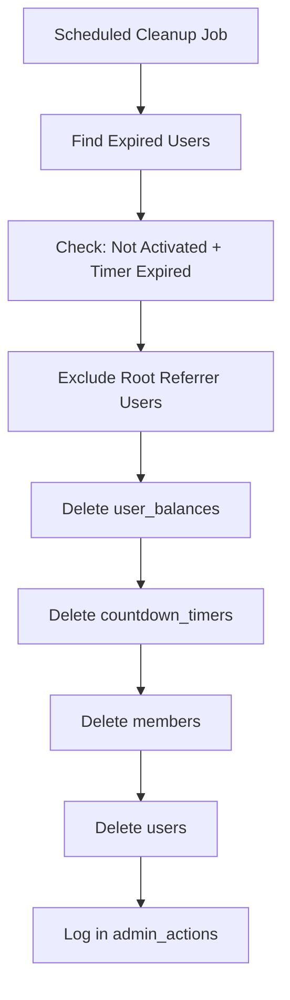

# 🚀 Complete Auth & Member System Deployment Guide

## Overview
This system implements the complete Beehive authentication and membership flow:
1. **Supabase Auth** → **Public Users** sync
2. **NFT Claim Records** → **Member Activation** → **Referral System**
3. **Countdown Cleanup** for inactive users
4. **Reward Distribution** only for activated members

## 📋 Deployment Steps

### 1. Deploy SQL Functions
Execute the complete SQL script in your Supabase SQL editor:

```bash
# Copy the SQL script to Supabase
cat /home/runner/workspace/complete_auth_member_system.sql
```

**Key Functions Created:**
- `handle_new_user()` - Syncs auth.users → public.users
- `activate_member_with_nft_claim()` - Complete NFT claim → member activation flow  
- `cleanup_expired_users()` - Removes inactive users after countdown
- `process_referral_rewards()` - Distributes rewards to referral chain
- `run_scheduled_cleanup()` - Scheduled cleanup job

### 2. Deploy Updated Supabase Edge Functions
Deploy the simplified auth function:

```bash
# Set your Supabase access token
export SUPABASE_ACCESS_TOKEN=your_token_here

# Deploy the auth function
supabase functions deploy auth --project-ref cvqibjcbfrwsgkvthccp
```

### 3. Set Up Scheduled Cleanup (Optional)
Create a Supabase cron job to run cleanup periodically:

```sql
-- Run cleanup every 4 hours
SELECT cron.schedule(
    'cleanup-expired-users',
    '0 */4 * * *',  -- Every 4 hours
    'SELECT public.run_scheduled_cleanup();'
);
```

### 4. Update Frontend (Optional)
The frontend can now use the simplified auth function directly.

## 🔄 Complete User Flow

### New User Registration Flow:
```mermaid
graph TD
    A[User Connects Wallet] --> B[Supabase Auth Login]
    B --> C[handle_new_user() Trigger]
    C --> D[Create public.users Record]
    D --> E[Create members Record NOT ACTIVATED]
    E --> F[Create user_balances Record]  
    F --> G[Start 48h Countdown Timer]
    G --> H[User in Registration State]
```

### NFT Claim → Member Activation Flow:
```mermaid
graph TD
    A[User Claims NFT] --> B[activate_member_with_nft_claim()]
    B --> C[Create nft_purchases Record]
    C --> D[Create orders Record] 
    D --> E[Activate membership]
    E --> F[Stop countdown timer]
    F --> G[Insert referrals Record]
    G --> H[process_referral_rewards()]
    H --> I[Distribute USDT rewards]
    I --> J[Member Fully Activated]
```

### Cleanup Flow:


## 🎯 Key Features

### ✅ Proper NFT Claim Records
- **Before**: Users became members without NFT records
- **Now**: NFT purchase record created FIRST, then membership activation

### ✅ Auth Sync
- **auth.users** automatically synced to **public.users**
- Proper wallet address handling
- Default root referrer assignment

### ✅ Referrals Only for Members  
- **Before**: Referrals created during registration
- **Now**: Referrals ONLY created when user becomes activated member

### ✅ Countdown Cleanup System
- 48-hour timer for user activation
- Automatic cleanup of inactive users
- Protection for root referrer users
- Audit trail in admin_actions

### ✅ Reward System
- Rewards ONLY distributed to activated members
- Multi-layer referral rewards (up to 19 layers)
- Layer-based reward amounts:
  - Layer 1 (Direct): 100 USDT
  - Layers 2-3: 50 USDT
  - Layers 4-7: 25 USDT  
  - Layers 8-19: 10 USDT

## 🔧 Manual Operations

### Check System Status:
```sql
-- Check users awaiting activation
SELECT u.wallet_address, u.created_at, ct.end_time, 
       (ct.end_time - NOW()) as time_remaining
FROM users u 
JOIN countdown_timers ct ON u.wallet_address = ct.wallet_address
JOIN members m ON u.wallet_address = m.wallet_address
WHERE m.is_activated = false AND ct.is_active = true;

-- Check activated members
SELECT COUNT(*) as active_members 
FROM members WHERE is_activated = true;
```

### Manual Cleanup:
```sql
-- Run cleanup manually
SELECT public.cleanup_expired_users();
```

### Manual Member Activation:
```sql
-- Activate a specific member
SELECT public.activate_member_with_nft_claim('0x1234...', 'membership', 'manual_activation');
```

### Process Rewards:
```sql
-- Process rewards for a new member
SELECT public.process_referral_rewards('0x1234...', 1);
```

## 🛡️ Security Features

1. **Protected Root Users**: Users with root referrer cannot be cleaned up
2. **Audit Trail**: All actions logged in admin_actions table
3. **Foreign Key Integrity**: Proper cleanup order to avoid constraint violations  
4. **Member-Only Operations**: Referrals and rewards only for activated members
5. **Timer Protection**: Countdown system prevents abandoned registrations
6. **⚠️ WALLET CASE PRESERVATION**: All wallet addresses preserve original case for withdrawal compatibility

## 📊 Monitoring

### Key Metrics to Monitor:
- Users awaiting activation vs expired users
- NFT claim success rate  
- Referral reward distribution
- System cleanup efficiency
- Member activation timeline

### Admin Queries:
```sql
-- System health check
SELECT 
  (SELECT COUNT(*) FROM users) as total_users,
  (SELECT COUNT(*) FROM members WHERE is_activated = true) as active_members,
  (SELECT COUNT(*) FROM countdown_timers WHERE is_active = true) as pending_activations,
  (SELECT COUNT(*) FROM nft_purchases) as total_nft_claims;
```

## 🚨 Important Notes

1. **Deploy SQL First**: Run the SQL script before deploying edge functions
2. **Test Activation**: Test the complete flow in a staging environment
3. **Monitor Cleanup**: Check that cleanup is working but not too aggressive
4. **Backup Before**: Always backup before running major database changes
5. **Root Wallet**: Ensure root wallet (0x0000...0001) is properly created
6. **⚠️ CRITICAL: WALLET CASE**: All wallet addresses preserve original case (no LOWER()) for withdrawal compatibility

This system now properly handles the complete membership logic you requested: **Users register → Claim NFT → Become members → Get referrals → Earn rewards**, with proper cleanup of inactive users.