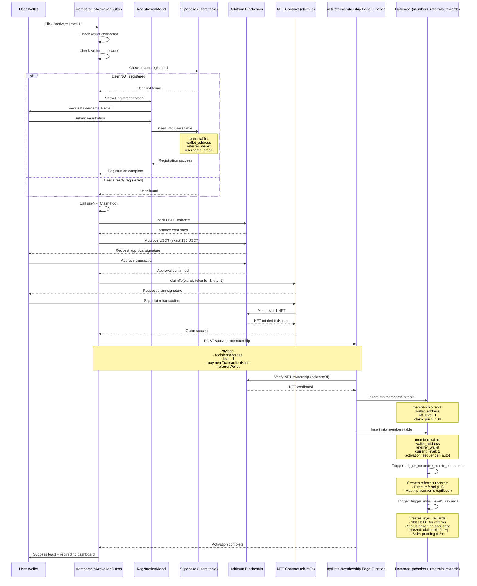

# Level 1 Activation Flow - Complete Guide
# Level 1 激活流程 - 完整指南

**Updated / 更新**: 2025-10-08
**Component / 组件**: `MembershipActivationButton`
**Edge Function / 边缘函数**: `activate-membership`

---

## Complete Activation Flow / 完整激活流程

### Step-by-Step Process / 分步流程



---

## Frontend Code Flow / 前端代码流程

### 1. User Registration Check / 用户注册检查

**File / 文件**: `MembershipActivationButton.tsx`

```typescript
// Line 104-181: checkEligibility()
const checkEligibility = async () => {
  // 1. Check if user is registered
  const { data: userData } = await authService.getUser(account.address);

  if (!userData) {
    // Show registration modal
    toast({
      title: t('registration.required'),
      description: t('registration.requiredDesc'),
    });
    setShowRegistrationModal(true);
    return;
  }

  // 2. Validate referrer
  const membershipResult = await authService.isActivatedMember(referrerWallet);

  if (!membershipResult.isActivated) {
    toast({
      title: 'Invalid Referrer',
      description: 'Referrer must be an active member',
      variant: 'destructive',
    });
    return;
  }

  // 3. Check NFT ownership
  const hasNFT = await balanceOf({
    contract: nftContract,
    address: account.address,
    tokenId: BigInt(1),
  });

  setIsEligible(!hasNFT); // Can only claim if don't have NFT yet
};
```

### 2. Registration Modal Flow / 注册模态框流程

**File / 文件**: `RegistrationModal.tsx`

```typescript
// Line 140-179: handleSubmit()
const handleSubmit = async (e: React.FormEvent) => {
  e.preventDefault();

  if (!validateForm()) return;

  // Register user with authService
  const { data: result, error, isExisting } = await authService.registerUser(
    walletAddress,
    formData.username.trim(),
    formData.email.trim() || undefined,
    referrerWallet // ✅ IMPORTANT: Pass referrer wallet
  );

  if (error) {
    throw new Error(error.message);
  }

  toast({
    title: isExisting ? 'Welcome Back' : 'Registration Success',
    description: isExisting ? 'Existing user' : 'New user created',
  });

  // Close modal and trigger parent callback
  onClose();
  onRegistrationComplete(); // ✅ This triggers re-check in MembershipActivationButton
};
```

**Database Record Created / 数据库记录已创建**:
```sql
INSERT INTO users (wallet_address, username, email, referrer_wallet, role, created_at)
VALUES (
  '0x380Fd6A57Fc2DF6F10B8920002e4acc7d57d61c0',
  'user123',
  'user@example.com',
  '0x479ABda60F8c62a7C3fba411ab948a8BE0E616Ab',
  'user',
  NOW()
);
```

### 3. NFT Claim Flow / NFT 领取流程

**File / 文件**: `MembershipActivationButton.tsx` → `core/NFTClaimButton.tsx`

```typescript
// Line 271-285: handleActivate() - Pre-claim check
const handleActivate = async () => {
  // ✅ CRITICAL: Check registration again before claiming
  const userResult = await authService.getUser(account.address);

  if (!userResult?.data) {
    toast({
      title: 'Registration Required',
      description: 'Please register to claim your NFT',
    });
    setShowRegistrationModal(true);
    return; // ❌ STOP - cannot proceed without registration
  }

  // ✅ Proceed to claim
  const result = await claimNFT({
    level: 1,
    priceUSDT: 130, // Level 1 price
    activationEndpoint: 'activate-membership', // ✅ CORRECT endpoint
    activationPayload: {
      referrerWallet: referrerWallet, // From users table
    },
    onSuccess: () => { /* ... */ },
    onError: () => { /* ... */ },
  });
};
```

**Blockchain Steps / 区块链步骤**:

```typescript
// core/NFTClaimButton.tsx: claimNFT()

// Step 1: Check USDT balance
const tokenBalance = await erc20BalanceOf({
  contract: usdtContract,
  address: account.address,
});
// Required: >= 130 USDT (130,000,000 with 6 decimals)

// Step 2: Approve USDT (EXACT amount)
const approveTransaction = approve({
  contract: usdtContract,
  spender: NFT_CONTRACT,
  amount: '130000000', // ✅ Exact 130 USDT, NOT unlimited
});
await sendTransaction(approveTransaction, account);

// Step 3: Claim NFT
const claimTransaction = claimTo({
  contract: nftContract,
  to: account.address,
  tokenId: BigInt(1), // Level 1
  quantity: BigInt(1),
});
const txResult = await sendTransaction(claimTransaction, account);

// Returns transaction hash for backend verification
console.log('Transaction hash:', txResult.transactionHash);
```

### 4. Backend Activation Flow / 后端激活流程

**Edge Function / 边缘函数**: `supabase/functions/activate-membership/index.ts`

```typescript
// POST /activate-membership
const requestBody = {
  recipientAddress: '0x380Fd6A57Fc2DF6F10B8920002e4acc7d57d61c0',
  level: 1,
  paymentTransactionHash: '0xabc...', // From claimTo transaction
  paymentAmount: 130,
  referrerWallet: '0x479ABda60F8c62a7C3fba411ab948a8BE0E616Ab',
};

// Step 1: Verify user registered (STRICT CHECK)
const { data: userData } = await supabase
  .from('users')
  .select('*')
  .ilike('wallet_address', walletAddress)
  .single();

if (!userData) {
  return { success: false, error: 'REGISTRATION_REQUIRED' };
}

// Step 2: Verify on-chain NFT ownership
const balance = await readContract({
  contract: nftContract,
  method: "balanceOf",
  params: [walletAddress, BigInt(level)]
});

if (balance === 0) {
  return { success: false, error: 'NFT_OWNERSHIP_REQUIRED' };
}

// Step 3: Create membership record
const { data: membership } = await supabase
  .from('membership')
  .insert({
    wallet_address: walletAddress,
    nft_level: 1,
    claim_price: 130,
    is_member: true,
  })
  .select()
  .single();

// Step 4: Create members record (triggers multiple database triggers)
const nextSequence = await supabase.rpc('get_next_activation_sequence');

const { data: member } = await supabase
  .from('members')
  .insert({
    wallet_address: walletAddress,
    referrer_wallet: referrerWallet, // From users table
    current_level: 1,
    activation_sequence: nextSequence,
    activation_time: new Date().toISOString(),
    total_nft_claimed: 1,
  })
  .select()
  .single();

// ✅ Database triggers automatically execute:
// - trigger_recursive_matrix_placement (creates referrals)
// - trigger_initial_level1_rewards (creates layer_rewards)
// - sync_member_to_membership_trigger
// - trigger_auto_create_balance_with_initial

// Step 5: Matrix placement (via trigger)
// Calls: fn_recursive_matrix_placement(member_wallet, referrer_wallet)
// Creates records in referrals table for all upline matrices

// Step 6: Direct reward creation (via trigger)
// Calls: trigger_layer_rewards_on_upgrade(member_wallet, 1, 100)
// Creates direct_reward for referrer with status based on sequence

return {
  success: true,
  membership,
  member,
  completedSteps: {
    membershipCreated: true,
    memberRecordCreated: true,
    matrixPlaced: true,
    rewardCreated: true,
  },
};
```

---

## Database Triggers Execution / 数据库触发器执行

### After `members` INSERT / 在插入 members 后

#### 1. `trigger_recursive_matrix_placement`

```sql
-- Creates referrals records for:
-- 1. Direct referral (member → referrer)
-- 2. All upline matrix placements (referrer → referrer's referrer → ...)

INSERT INTO referrals (
  member_wallet,
  referrer_wallet,
  matrix_root_wallet,
  is_direct_referral,
  matrix_layer,
  matrix_position,
  member_activation_sequence
) VALUES (
  -- Direct referral
  '0x380Fd6A57Fc2DF6F10B8920002e4acc7d57d61c0',
  '0x479ABda60F8c62a7C3fba411ab948a8BE0E616Ab',
  '0x479ABda60F8c62a7C3fba411ab948a8BE0E616Ab',
  true, -- is_direct_referral
  1,    -- matrix_layer
  'L',  -- matrix_position (L/M/R based on BFS)
  (next_sequence)
);

-- Plus additional spillover placements in all upline matrices
```

#### 2. `trigger_initial_level1_rewards`

```sql
-- Determines reward status based on:
-- 1. Referrer's current direct reward count (sequence)
-- 2. Referrer's current level

-- Example for 4th direct reward:
INSERT INTO layer_rewards (
  reward_recipient_wallet,
  triggering_member_wallet,
  triggering_nft_level,
  reward_amount,
  status, -- ⚠️ 'pending' if sequence >= 3 AND referrer_level = 1
  matrix_layer,
  layer_position,
  recipient_required_level, -- 2 for 3rd+ rewards
  reward_sequence
) VALUES (
  '0x479ABda60F8c62a7C3fba411ab948a8BE0E616Ab', -- referrer
  '0x380Fd6A57Fc2DF6F10B8920002e4acc7d57d61c0', -- new member
  1,    -- Level 1 activation
  100,  -- 100 USDT base reward
  'pending', -- ⚠️ PENDING because it's 4th reward and referrer is Level 1
  1,    -- Direct referral layer
  'DIRECT',
  2,    -- Requires Level 2 to claim
  4     -- 4th direct reward for this referrer
);
```

**Reward Status Logic / 奖励状态逻辑**:

```typescript
function determineRewardStatus(rewardSequence: number, referrerLevel: number): string {
  if (rewardSequence <= 2) {
    // 1st or 2nd reward
    return referrerLevel >= 1 ? 'claimable' : 'pending';
  } else {
    // 3rd+ reward
    return referrerLevel >= 2 ? 'claimable' : 'pending';
  }
}

// Examples:
// Sequence 1, Level 1 → 'claimable'
// Sequence 2, Level 1 → 'claimable'
// Sequence 3, Level 1 → 'pending' ⚠️
// Sequence 4, Level 1 → 'pending' ⚠️
// Sequence 3, Level 2 → 'claimable' ✅
// Sequence 4, Level 2 → 'claimable' ✅
```

---

## Verification Queries / 验证查询

After activation, verify all records were created:
激活后，验证所有记录是否已创建：

### 1. Check Users Table / 检查用户表

```sql
SELECT wallet_address, referrer_wallet, username, created_at
FROM users
WHERE LOWER(wallet_address) = '0x380fd6a57fc2df6f10b8920002e4acc7d57d61c0';
```

**Expected / 期望**:
```
wallet_address: 0x380Fd6A57Fc2DF6F10B8920002e4acc7d57d61c0
referrer_wallet: 0x479ABda60F8c62a7C3fba411ab948a8BE0E616Ab
username: (user's choice)
created_at: (registration timestamp)
```

### 2. Check Membership Table / 检查会员表

```sql
SELECT wallet_address, nft_level, claim_price, claimed_at, is_member
FROM membership
WHERE LOWER(wallet_address) = '0x380fd6a57fc2df6f10b8920002e4acc7d57d61c0';
```

**Expected / 期望**:
```
wallet_address: 0x380Fd6A57Fc2DF6F10B8920002e4acc7d57d61c0
nft_level: 1
claim_price: 130.000000
claimed_at: (claim timestamp)
is_member: true
```

### 3. Check Members Table / 检查会员记录表

```sql
SELECT
  wallet_address,
  referrer_wallet,
  current_level,
  activation_sequence,
  activation_time,
  total_nft_claimed
FROM members
WHERE LOWER(wallet_address) = '0x380fd6a57fc2df6f10b8920002e4acc7d57d61c0';
```

**Expected / 期望**:
```
wallet_address: 0x380Fd6A57Fc2DF6F10B8920002e4acc7d57d61c0
referrer_wallet: 0x479ABda60F8c62a7C3fba411ab948a8BE0E616Ab
current_level: 1
activation_sequence: (auto-generated, e.g., 309)
activation_time: (activation timestamp)
total_nft_claimed: 1
```

### 4. Check Referrals (Direct) / 检查直推关系

```sql
SELECT
  member_wallet,
  referrer_wallet,
  matrix_root_wallet,
  is_direct_referral,
  matrix_layer,
  matrix_position,
  placed_at
FROM referrals
WHERE LOWER(member_wallet) = '0x380fd6a57fc2df6f10b8920002e4acc7d57d61c0'
  AND is_direct_referral = true;
```

**Expected / 期望**:
```
member_wallet: 0x380Fd6A57Fc2DF6F10B8920002e4acc7d57d61c0
referrer_wallet: 0x479ABda60F8c62a7C3fba411ab948a8BE0E616Ab
matrix_root_wallet: 0x479ABda60F8c62a7C3fba411ab948a8BE0E616Ab
is_direct_referral: true
matrix_layer: 1
matrix_position: L/M/R (based on BFS placement)
placed_at: (placement timestamp)
```

### 5. Check All Matrix Placements / 检查所有矩阵放置

```sql
SELECT
  member_wallet,
  matrix_root_wallet,
  referrer_wallet,
  matrix_layer,
  matrix_position,
  is_direct_referral,
  is_spillover_placement
FROM referrals
WHERE LOWER(member_wallet) = '0x380fd6a57fc2df6f10b8920002e4acc7d57d61c0'
ORDER BY matrix_layer, matrix_position;
```

**Expected / 期望**: Multiple rows showing placements in:
- Direct referrer's matrix (Layer 1)
- Referrer's referrer's matrix (Layer 2, spillover)
- And so on up the chain...

### 6. Check Direct Reward for Referrer / 检查推荐人的直推奖励

```sql
SELECT
  id,
  reward_recipient_wallet,
  triggering_member_wallet,
  reward_amount,
  status,
  matrix_layer,
  layer_position,
  recipient_required_level,
  reward_sequence,
  created_at
FROM layer_rewards
WHERE LOWER(reward_recipient_wallet) = '0x479abda60f8c62a7c3fba411ab948a8be0e616ab'
  AND LOWER(triggering_member_wallet) = '0x380fd6a57fc2df6f10b8920002e4acc7d57d61c0'
  AND matrix_layer = 1
  AND layer_position = 'DIRECT';
```

**Expected for 4th Referral / 第4个推荐的期望结果**:
```
reward_recipient_wallet: 0x479ABda60F8c62a7C3fba411ab948a8BE0E616Ab
triggering_member_wallet: 0x380Fd6A57Fc2DF6F10B8920002e4acc7d57d61c0
reward_amount: 100
status: pending  ⚠️ PENDING (4th reward, referrer is Level 1)
matrix_layer: 1
layer_position: DIRECT
recipient_required_level: 2  ⚠️ Needs Level 2 to claim
reward_sequence: 4
created_at: (reward creation timestamp)
```

### 7. Verify Referrer's Reward Sequence / 验证推荐人的奖励序列

```sql
SELECT
  reward_sequence,
  triggering_member_wallet,
  reward_amount,
  status,
  recipient_required_level,
  created_at
FROM layer_rewards
WHERE LOWER(reward_recipient_wallet) = '0x479abda60f8c62a7c3fba411ab948a8be0e616ab'
  AND matrix_layer = 1
  AND layer_position = 'DIRECT'
ORDER BY reward_sequence;
```

**Expected / 期望**:
```
Sequence 1: status = 'claimable', required_level = 1  (1st)
Sequence 2: status = 'claimable', required_level = 1  (2nd)
Sequence 3: status = 'pending', required_level = 2    (3rd) ⚠️
Sequence 4: status = 'pending', required_level = 2    (4th) ⚠️ NEW
```

---

## Important Notes / 重要说明

### ✅ Registration MUST Happen Before Claim / 注册必须在领取之前

1. **Frontend check** in `checkEligibility()` - shows modal if not registered
   前端检查 - 如果未注册则显示模态框

2. **Frontend check** in `handleActivate()` - double-checks before NFT claim
   前端检查 - NFT领取前再次检查

3. **Backend check** in `activate-membership` - STRICT validation
   后端检查 - 严格验证

If any check fails, the flow stops and prompts registration.
如果任何检查失败，流程停止并提示注册。

### ✅ Correct Edge Function / 正确的边缘函数

**USE**: `activate-membership` ✅
- Verifies NFT ownership on-chain
- Creates membership + members records
- Triggers matrix placement
- Creates direct rewards

**DO NOT USE**: `mint-and-send-nft` ❌
- Duplicate functionality
- Less comprehensive

### ✅ Reward Status Logic / 奖励状态逻辑

```typescript
Reward Sequence | Referrer Level | Status | Required Level
----------------|----------------|---------|---------------
1               | 1              | claimable | 1
2               | 1              | claimable | 1
3               | 1              | pending   | 2 ⚠️
4+              | 1              | pending   | 2 ⚠️
3+              | 2+             | claimable | 2 ✅
```

**Key Point / 关键点**: Referrers at Level 1 can only immediately claim their first 2 direct rewards. The 3rd and subsequent rewards require Level 2.

Level 1推荐人只能立即领取前2个直推奖励。第3个及后续奖励需要升级到Level 2。

---

## Testing Checklist / 测试清单

### Before Claim / 领取前

- [ ] Wallet connected to Arbitrum One
- [ ] USDT balance >= 130 USDT
- [ ] ETH balance sufficient for gas fees
- [ ] User NOT registered → Registration modal shows
- [ ] User registered → Can proceed to claim
- [ ] Referrer is valid active member
- [ ] No self-referral (wallet ≠ referrer)

### During Claim / 领取过程中

- [ ] USDT approval requested (exact 130 USDT)
- [ ] NFT claim transaction requested
- [ ] Transaction confirmed on-chain
- [ ] activate-membership Edge Function called
- [ ] NFT ownership verified by backend

### After Claim / 领取后

- [ ] `users` record exists with referrer_wallet
- [ ] `membership` record created (nft_level = 1)
- [ ] `members` record created with activation_sequence
- [ ] `referrals` record created (is_direct_referral = true)
- [ ] Multiple `referrals` records for spillover
- [ ] `layer_rewards` record created for referrer
- [ ] Reward status correct based on sequence
- [ ] User redirected to dashboard
- [ ] NFT visible in wallet

---

## Common Issues & Solutions / 常见问题和解决方案

### Issue 1: "Registration Required" Error / "需要注册"错误

**Cause / 原因**: User not in `users` table

**Solution / 解决方案**:
1. Click activation button
2. Registration modal appears
3. Fill username + email
4. Submit registration
5. Try claim again

### Issue 2: No Rewards Created / 未创建奖励

**Cause / 原因**: Database trigger not executing

**Check / 检查**:
```sql
-- Verify trigger exists
SELECT tgname, tgenabled FROM pg_trigger
WHERE tgrelid = 'members'::regclass;
```

**Solution / 解决方案**: Ensure `trigger_initial_level1_rewards` is enabled

### Issue 3: Wrong Reward Status / 错误的奖励状态

**Cause / 原因**: Incorrect sequence counting

**Check / 检查**:
```sql
-- Count existing direct rewards for referrer
SELECT COUNT(*) FROM layer_rewards
WHERE LOWER(reward_recipient_wallet) = LOWER('referrer_address')
  AND matrix_layer = 1
  AND layer_position = 'DIRECT';
```

**Solution / 解决方案**: Verify reward sequence logic in `trigger_layer_rewards_on_upgrade`

---

## Summary / 总结

### Complete Flow / 完整流程

1. **User Registration** (`users` table) ✅
2. **NFT Claim** (on-chain transaction) ✅
3. **Membership Record** (`membership` table) ✅
4. **Members Record** (`members` table) ✅
5. **Matrix Placement** (`referrals` table) ✅
6. **Direct Reward** (`layer_rewards` table) ✅
   - Status based on sequence and referrer level
   - 1st/2nd: claimable if Level 1+
   - 3rd+: pending if Level 1, claimable if Level 2+

### Key Components / 关键组件

- **Frontend**: `MembershipActivationButton` + `RegistrationModal`
- **Core Logic**: `useNFTClaim` hook in `core/NFTClaimButton.tsx`
- **Edge Function**: `supabase/functions/activate-membership/index.ts`
- **Database Triggers**: `trigger_recursive_matrix_placement`, `trigger_initial_level1_rewards`

### Success Criteria / 成功标准

✅ All 6 database records created
✅ Reward status correctly determined
✅ Matrix placements complete
✅ User can proceed to dashboard

---

**Document Updated / 文档更新**: 2025-10-08
**Ready for Testing / 准备测试**: ✅ YES
