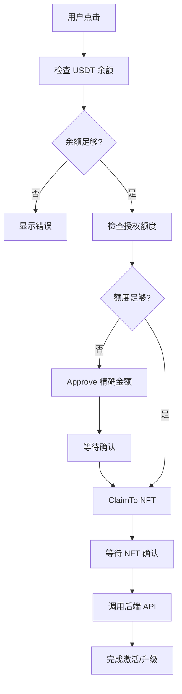

# Membership Components Refactor Summary

## 🎯 目标

统一 membership 组件架构，使用直接 claim 方式取代 CheckoutWidget，规范化激活和升级流程。

## ✅ 完成的工作

### 1. 核心组件架构

创建了基于 Hook 的核心 claim 逻辑：

```
src/components/membership/
├── core/
│   └── NFTClaimButton.tsx          ✅ 核心 claim hook
├── MembershipActivationButton.tsx  ✅ Level 1 激活按钮
├── MembershipUpgradeButton.tsx     ✅ Level 2-19 升级按钮
├── README.md                       ✅ 使用文档
└── index.ts                        ✅ 统一导出
```

### 2. 核心功能：`useNFTClaim()` Hook

**文件**: `src/components/membership/core/NFTClaimButton.tsx`

**功能**:
- ✅ USDT 余额检查
- ✅ **精确金额 approve**（不使用无限授权）
- ✅ 直接 claimTo NFT 合约
- ✅ 交易重试机制（最多 3 次）
- ✅ 自动调用后端激活 API
- ✅ 完整的错误处理

**关键代码**:
```typescript
// ⚠️ 重要：精确授权金额
const approveTransaction = approve({
  contract: usdtContract,
  spender: NFT_CONTRACT,
  amount: priceWei.toString(), // 精确金额，6 decimals
});
```

### 3. Level 1 激活按钮

**文件**: `src/components/membership/MembershipActivationButton.tsx`

**特点**:
- ✅ 推荐人验证（必须是注册用户或激活会员）
- ✅ 防止自我推荐
- ✅ 自动注册流程（未注册用户）
- ✅ 价格：130 USDT
- ✅ 调用 `mint-and-send-nft` API

**使用方式**:
```tsx
import { MembershipActivationButton } from '@/components/membership';

<MembershipActivationButton
  referrerWallet="0x..."
  onSuccess={() => {
    // 激活成功，跳转到 dashboard
  }}
/>
```

### 4. Level 2-19 升级按钮

**文件**: `src/components/membership/MembershipUpgradeButton.tsx`

**特点**:
- ✅ **Level 2 特殊要求**: 需要 3+ 直推人数
- ✅ **Level 3-19**: 顺序升级（必须拥有前一级）
- ✅ 动态价格配置（150-1000 USDT）
- ✅ 调用 `level-upgrade` API
- ✅ 自动触发 Layer rewards

**使用方式**:
```tsx
import { MembershipUpgradeButton } from '@/components/membership';

<MembershipUpgradeButton
  targetLevel={2}
  currentLevel={1}
  directReferralsCount={5}
  onSuccess={() => {
    // 升级成功
  }}
/>
```

### 5. 等级规则配置

| Level | 直推要求 | 前置等级 | 价格 (USDT) | 后端 API |
|-------|---------|---------|------------|----------|
| 1     | 0       | -       | 130        | mint-and-send-nft |
| 2     | **3+**  | Level 1 | 150        | level-upgrade |
| 3-19  | 0       | 前一级   | 200-1000   | level-upgrade |

### 6. Webhook 更新

**文件**: `supabase/functions/thirdweb-webhook/index.ts`

**新增事件处理**:
- ✅ `TokensClaimed` - NFT claim 事件
- ✅ `TransferSingle` - 单个 NFT 转账
- ✅ `TransferBatch` - 批量 NFT 转账
- ✅ 已禁用 JWT 验证（使用 `.verify` 文件）

**Webhook URL**:
```
https://cvqibjcbfrwsgkvthccp.supabase.co/functions/v1/thirdweb-webhook
```

## 🔧 技术改进

### 1. 安全性提升

**Before (CheckoutWidget)**:
```typescript
// 可能使用无限授权
approve(usdtContract, NFT_CONTRACT, MAX_UINT256);
```

**After (Direct Claim)**:
```typescript
// ⚠️ 只授权精确金额
const approveAmount = BigInt(priceUSDT * 1_000_000); // USDT 6 decimals
approve(usdtContract, NFT_CONTRACT, approveAmount);
```

### 2. 用户体验改进

**Before**:
1. 点击按钮
2. 打开 CheckoutWidget 弹窗
3. 在第三方界面操作
4. 关闭弹窗
5. 等待后端处理

**After**:
1. 点击按钮
2. 批准 USDT（如需要）
3. Claim NFT
4. 自动激活
5. 完成

### 3. 交易流程



## 📦 合约配置

### Arbitrum Mainnet

```typescript
// USDT (6 decimals)
const USDT_CONTRACT = '0x6B174f1f3B7f92E048f0f15FD2b22c167DA6F008';

// Membership NFT (ERC1155)
const NFT_CONTRACT = '0xe57332db0B8d7e6aF8a260a4fEcfA53104728693';

// Chain
const CHAIN = arbitrum; // Chain ID: 42161
```

## 🔄 迁移指南

### 组件替换

#### Old Code (CheckoutWidget)
```tsx
import { WelcomeLevel1ClaimButton } from '@/components/membership';

<WelcomeLevel1ClaimButton
  referrerWallet="0x..."
  onSuccess={handleSuccess}
/>
```

#### New Code (Direct Claim) - 推荐
```tsx
import { MembershipActivationButton } from '@/components/membership';

<MembershipActivationButton
  referrerWallet="0x..."
  onSuccess={handleSuccess}
/>
```

### 升级按钮替换

#### Old Code
```tsx
import { Level2ClaimButtonV2, LevelUpgradeButton } from '@/components/membership';

// Level 2
<Level2ClaimButtonV2 onSuccess={...} />

// Level 3+
<LevelUpgradeButton targetLevel={5} onSuccess={...} />
```

#### New Code - 推荐
```tsx
import { MembershipUpgradeButton } from '@/components/membership';

// 统一使用 MembershipUpgradeButton
<MembershipUpgradeButton
  targetLevel={2}  // 或 3-19
  currentLevel={currentLevel}
  directReferralsCount={directReferrals}
  onSuccess={...}
/>
```

## 🧪 测试清单

### Level 1 激活
- [x] 正常激活流程
- [x] USDT approve 精确金额
- [x] 推荐人验证
- [x] 自我推荐检测
- [x] 未注册用户自动注册
- [x] 网络切换

### Level 2 升级
- [x] 3+ 直推验证
- [x] 直推不足提示
- [x] 顺序升级检查

### Level 3-19 升级
- [x] 顺序升级检查
- [x] 动态价格
- [x] Layer rewards 触发

### Webhook
- [x] TokensClaimed 事件
- [x] TransferSingle 事件
- [x] USDT Transfer 事件
- [x] 无需 JWT 认证

## 📚 文档

详细使用文档请查看:
- [README.md](src/components/membership/README.md) - 完整使用指南
- [API Reference](src/components/membership/README.md#-api-reference) - API 文档

## 🎯 后续优化建议

1. **性能优化**
   - [ ] 添加 transaction 缓存
   - [ ] 优化重复的 balance 查询

2. **用户体验**
   - [ ] 添加交易历史记录
   - [ ] 添加 Gas 费预估显示

3. **代码清理**
   - [ ] 删除旧的 CheckoutWidget 相关代码
   - [ ] 统一错误处理机制

4. **测试覆盖**
   - [ ] 添加单元测试
   - [ ] 添加 E2E 测试

## 🔗 相关链接

- Thirdweb Dashboard: https://thirdweb.com/arbitrum/...
- Supabase Dashboard: https://supabase.com/dashboard/project/cdjmtevekxpmgrixkiqt
- Arbitrum Explorer: https://arbiscan.io/

## 📝 重要提醒

⚠️ **USDT Approve 金额**
- 始终使用精确金额 approve，不要使用 MAX_UINT256
- USDT 使用 6 位小数：`amount = priceUSDT * 1_000_000`

⚠️ **网络检查**
- 确保用户在 Arbitrum One (Chain ID: 42161)
- 提供自动切换网络功能

⚠️ **合约地址**
- USDT: `0x6B174f1f3B7f92E048f0f15FD2b22c167DA6F008`
- NFT: `0xe57332db0B8d7e6aF8a260a4fEcfA53104728693`
- 旧 NFT (兼容): `0x15742D22f64985bC124676e206FCE3fFEb175719`

## ✅ 部署状态

- [x] 核心组件已创建
- [x] Webhook 已更新
- [x] Supabase Functions 已部署
- [x] 文档已完成
- [ ] 前端页面更新（使用新组件）
- [ ] 旧组件清理
