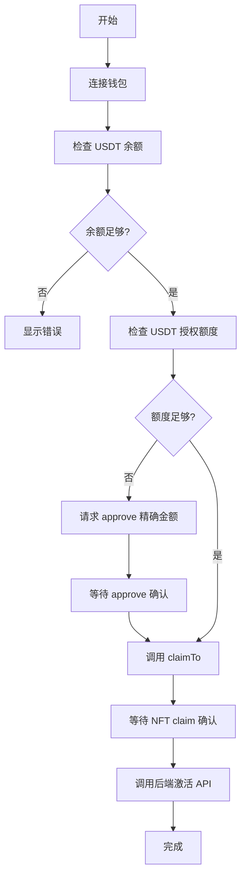

# Membership Components - Architecture & Usage

## 📋 Overview

统一的 NFT membership 组件架构，使用直接 claim 方式（approve + claimTo），取代了之前的 CheckoutWidget 方案。

## 🏗️ Architecture

### Core Components

```
membership/
├── core/
│   └── NFTClaimButton.tsx          # 核心 claim 逻辑（Hook）
├── MembershipActivationButton.tsx  # Level 1 激活按钮
├── MembershipUpgradeButton.tsx     # Level 2-19 升级按钮
└── index.ts                        # 统一导出
```

### Key Features

✅ **统一的 Claim 流程**
- USDT 余额检查
- **精确金额** approve（不使用无限授权）
- 直接 claimTo NFT 合约
- 自动调用后端激活 API

✅ **不同等级的规则**
- **Level 1**: 需要有效推荐人，无直推限制
- **Level 2**: 需要 3+ 直推人数
- **Level 3-19**: 顺序升级，无额外限制

## 📦 Usage

### 1. Level 1 Activation (激活会员)

```tsx
import { MembershipActivationButton } from '@/components/membership';

function WelcomePage() {
  return (
    <MembershipActivationButton
      referrerWallet="0x..." // 必需：推荐人钱包地址
      onSuccess={() => {
        console.log('Activation successful!');
        // 跳转到 dashboard 等
      }}
    />
  );
}
```

**特点：**
- ✅ 验证推荐人（必须是注册用户或激活会员）
- ✅ 防止自我推荐
- ✅ 价格：130 USDT
- ✅ 自动注册流程（如果用户未注册）

### 2. Level 2-19 Upgrade (升级会员)

```tsx
import { MembershipUpgradeButton } from '@/components/membership';

function UpgradePage() {
  const currentLevel = 1; // 从数据库获取
  const directReferrals = 5; // 从数据库获取

  return (
    <MembershipUpgradeButton
      targetLevel={2}           // 目标等级 2-19
      currentLevel={currentLevel}
      directReferralsCount={directReferrals}
      onSuccess={() => {
        console.log('Upgrade successful!');
      }}
    />
  );
}
```

**特点：**
- ✅ **Level 2 特殊要求**：需要 3+ 直推人数
- ✅ **Level 3-19**：顺序升级（必须拥有前一级）
- ✅ 动态价格：150-1000 USDT
- ✅ 自动触发 Layer rewards

### 3. 使用核心 Hook（高级用法）

```tsx
import { useNFTClaim } from '@/components/membership';

function CustomClaimButton() {
  const { claimNFT, isProcessing, currentStep } = useNFTClaim();

  const handleClaim = async () => {
    const result = await claimNFT({
      level: 5,
      priceUSDT: 300,
      activationEndpoint: 'level-upgrade',
      activationPayload: {
        targetLevel: 5,
        network: 'mainnet',
      },
      onSuccess: () => {
        console.log('Claim successful!');
      },
      onError: (error) => {
        console.error('Claim failed:', error);
      },
    });

    if (result.success) {
      console.log('Transaction:', result.txHash);
    }
  };

  return (
    <button onClick={handleClaim} disabled={isProcessing}>
      {isProcessing ? currentStep : 'Claim NFT'}
    </button>
  );
}
```

## 🔧 Technical Details

### 1. Claim Flow



### 2. 合约地址

```typescript
const USDT_CONTRACT = '0x6B174f1f3B7f92E048f0f15FD2b22c167DA6F008'; // Arbitrum Mainnet
const NFT_CONTRACT = '0xe57332db0B8d7e6aF8a260a4fEcfA53104728693';  // Arbitrum Mainnet
```

### 3. 价格配置

```typescript
const LEVEL_PRICING = {
  1: 130,   // Level 1 activation
  2: 150,   // Level 2 upgrade
  3: 200,
  4: 250,
  5: 300,
  6: 350,
  7: 400,
  8: 450,
  9: 500,
  10: 550,
  11: 600,
  12: 650,
  13: 700,
  14: 750,
  15: 800,
  16: 850,
  17: 900,
  18: 950,
  19: 1000  // Level 19 upgrade
};
```

### 4. 等级要求

| Level | 直推人数要求 | 前置等级 | 价格 (USDT) |
|-------|------------|---------|------------|
| 1     | 0          | -       | 130        |
| 2     | **3+**     | Level 1 | 150        |
| 3-19  | 0          | 前一级   | 200-1000   |

### 5. 安全特性

✅ **精确 Approve**
```typescript
// ⚠️ 只授权所需的精确金额，不使用无限授权
const approveAmount = BigInt(priceUSDT * 1_000_000); // USDT 6 decimals
```

✅ **交易重试**
- 自动重试失败的交易（最多 3 次）
- 用户取消交易会立即停止

✅ **网络检查**
- 自动检测错误的网络
- 提供一键切换到 Arbitrum One

## 🔄 Migration Guide

### 从旧组件迁移

**Old (CheckoutWidget):**
```tsx
import { WelcomeLevel1ClaimButton } from '@/components/membership';

<WelcomeLevel1ClaimButton
  referrerWallet="0x..."
  onSuccess={...}
/>
```

**New (Direct Claim):**
```tsx
import { MembershipActivationButton } from '@/components/membership';

<MembershipActivationButton
  referrerWallet="0x..."
  onSuccess={...}
/>
```

### 主要区别

| 特性 | Old (CheckoutWidget) | New (Direct Claim) |
|-----|---------------------|-------------------|
| 支付方式 | 第三方支付界面 | 直接 approve + claim |
| 授权方式 | CheckoutWidget 处理 | 精确金额 approve |
| 用户体验 | 多步骤弹窗 | 一键流程 |
| Gas 费用 | 用户支付 | 用户支付 |
| 合约调用 | 间接 | 直接 claimTo |

## 🧪 Testing

### Test Scenarios

1. **Level 1 Activation**
   - ✅ 正常激活流程
   - ✅ 无效推荐人
   - ✅ 自我推荐检测
   - ✅ 未注册用户自动注册
   - ✅ 已拥有 NFT 检测

2. **Level 2 Upgrade**
   - ✅ 3+ 直推人数验证
   - ✅ 直推不足提示
   - ✅ 顺序升级检查

3. **Level 3-19 Upgrade**
   - ✅ 顺序升级检查
   - ✅ 动态价格验证
   - ✅ Layer rewards 触发

4. **Error Handling**
   - ✅ USDT 余额不足
   - ✅ ETH gas 费不足
   - ✅ 用户拒绝交易
   - ✅ 网络错误重试

## 📚 API Reference

### `useNFTClaim()`

**Returns:**
```typescript
{
  claimNFT: (config: NFTClaimConfig) => Promise<ClaimResult>;
  isProcessing: boolean;
  currentStep: string;
}
```

**NFTClaimConfig:**
```typescript
interface NFTClaimConfig {
  level: number;                    // 1-19
  priceUSDT: number;                // 价格（USDT）
  onSuccess?: () => void;           // 成功回调
  onError?: (error: Error) => void; // 失败回调
  activationEndpoint?: string;      // 后端激活 API
  activationPayload?: Record<string, any>; // 额外数据
}
```

**ClaimResult:**
```typescript
interface ClaimResult {
  success: boolean;
  txHash?: string;  // 交易哈希（成功时）
  error?: string;   // 错误信息（失败时）
}
```

## 🐛 Troubleshooting

### Common Issues

**1. "Insufficient USDT balance"**
- 确保钱包有足够的 USDT（Arbitrum One）
- 检查 USDT 合约地址是否正确

**2. "User rejected transaction"**
- 用户在钱包中拒绝了交易
- 可以重新尝试

**3. "Wrong network"**
- 切换到 Arbitrum One (Chain ID: 42161)
- 使用组件内置的网络切换按钮

**4. "Requirements not met" (Level 2)**
- 需要至少 3 个直推人数
- 检查数据库中的 direct_referrals 数据

## 📝 Notes

- 所有组件都支持深色模式
- 使用 Thirdweb v5 SDK
- USDT 使用 6 位小数
- 自动处理 gas 费估算
- 支持交易重试机制
